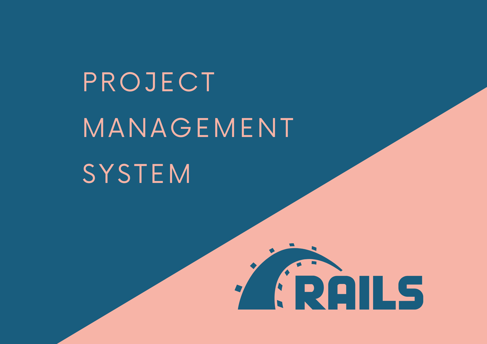

## Project URL
<https://ypc-rails-pms.herokuapp.com>

## Github repo link
<https://github.com/EthanChenYen-Peng/pms>

## Introduction

This is a training project I did as part of a job interview, it also serves as a great way to explore the basics of Rails. Project functionalities:

- Users can do CURD operations on projects.
- Once login, the user can only view his projects.
- Users can set the project's start date and due date.
- Users can set the project's priority, which is available in three levels (high, medium, and low).
- Users can set project's status ( to-do, doing, and done)
- Users can add labels to projects.
- Users can filter projects base on status and labels.
- Users can filter projects base on title and content.
- Users can sort projects base on priority, start date, and end date.
- Admin users can do CRUD operations on users.

## Technologies

- Ruby on Rails         (Web application framework)
- Bootstrap 4            (CSS framework)
- Heroku                    (Application deployment)
- Github Actions       (CI tool)

## What I have learned from the project

- Implement CURD in Rails.
- From helper and error ActiveRecord validations.
- Reducing code duplication using various hooks in the controller.
- Importance of database indexing.
- Using counter_cache to resolve N+1 problem.
- Implement acceptance tests and unit tests with capybara and rspec.
- Rails internalization.
- Postgres full-text search

### Deployment steps with Heroku

1. Install Heroku CLI
2. Create an app on Heroku. This will also add `heroku` as a remote target.

    ```ruby
    heroku create
    ```

3. Deploy app

    ```ruby
    git push heroku master
    ```

4. Migrate database

    ```ruby
    heroku run rails db:migrate
    ```

## References and learning resources

---

### Rails learning resources

[https://www.udemy.com/course/the-complete-ruby-on-rails-developer-course/](https://www.udemy.com/course/the-complete-ruby-on-rails-developer-course/)

[https://activerailsbook.com/](https://activerailsbook.com/)

[https://backend.turing.io/](https://backend.turing.io/)

[https://railsbook.tw/](https://railsbook.tw/)

[https://guides.rubyonrails.org/getting_started.html](https://guides.rubyonrails.org/getting_started.html)

### Postgres full text search

[pganalyze/full-text-search-rails](https://github.com/pganalyze/full-text-search-rails)

[8.11. Text Search Types](https://www.postgresql.org/docs/current/datatype-textsearch.html)

[PostgreSQL: More performance for LIKE and ILIKE statements - Cybertec](https://www.cybertec-postgresql.com/en/postgresql-more-performance-for-like-and-ilike-statements/)

[Full Text Search in Milliseconds with Rails and PostgreSQL](https://pganalyze.com/blog/full-text-search-ruby-rails-postgres)

### Heroku for deployment

[https://devcenter.heroku.com/articles/getting-started-with-rails6](https://devcenter.heroku.com/articles/getting-started-with-rails6)

